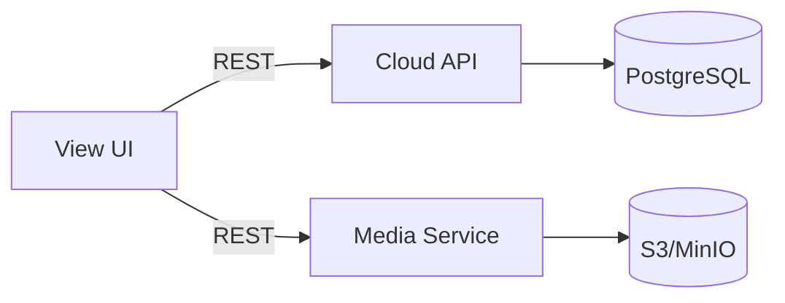

# Drill View Service

Пользовательский интерфейс для операторов и аналитиков. Отображает текущую телеметрию, виджеты, таблицы, архив и медиа‑контент по буровым установкам.

## Назначение
- визуализация данных по буровым установкам
- отображение динамических виджетов/таблиц
- страницы оборудования (архив, схемы, видео, документы)
- страницы статусов (байпас, аварии, КТУ и др.)

## Основные маршруты
```text
/                              — список буровых
/rigs/:rigId                   — главная страница буровой
/rigs/:rigId/widgets/:pageType — динамические страницы
/rigs/:rigId/archive           — архив
/rigs/:rigId/winch-block       — насос/лебедка (пример)
/rigs/:rigId/video             — видео
/rigs/:rigId/documents         — документы
```

## Интеграции
- `cloud` API: текущие значения, история, конфиги таблиц/виджетов
- `media` API: изображения, документы, видео



## Переменные окружения
- `VITE_API_URL` — базовый URL `cloud` API
- `VITE_MEDIA_API_URL` — базовый URL `media` API (fallback на `VITE_API_URL`)
- `VITE_INFRA_SECRET_KEY` — ключ для защищенных инфраструктурных эндпоинтов

## Запуск
```bash
npm install
npm run dev
```

## Сборка
```bash
npm run build
npm run preview
```

## Особенности логики
- Данные отображаются согласно привязке `tag ↔ edge`.
- Динамические страницы используют конфигурации, заданные в `admin`.
